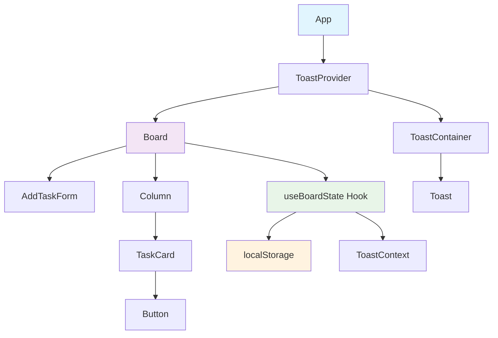
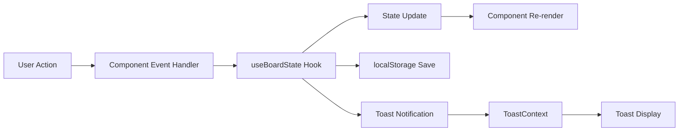

# Architecture Documentation

## 🏗️ Chosen Architectural Pattern

### **Component-Based Architecture with Custom Hooks**

FlowBoard follows a **Component-Based Architecture** pattern with the following characteristics:

- **Presentational Components**: Pure UI components that receive props and render UI
- **Container Components**: Smart components that manage state and business logic
- **Custom Hooks**: Reusable stateful logic extraction
- **Context API**: Global state management for cross-component communication

### **Why This Pattern?**

1. **Separation of Concerns**: UI logic separated from business logic
2. **Reusability**: Components can be easily reused and composed
3. **Testability**: Each component can be tested in isolation
4. **Maintainability**: Clear boundaries between different responsibilities
5. **Scalability**: Easy to add new features without affecting existing code

## 🧩 Component Hierarchy Diagram

```
App
├── ToastProvider
│   ├── Board (Container)
│   │   ├── AddTaskForm (Presentational)
│   │   └── Column (Presentational)
│   │       └── TaskCard (Presentational)
│   │           └── Button (Presentational)
│   └── ToastContainer (Presentational)
│       └── Toast (Presentational)
```

### **Component Relationships**



## 🔄 State Management Explanation

### **State Management Strategy**

FlowBoard uses a **hybrid state management approach**:

1. **Local State**: Component-level state using `useState`
2. **Custom Hooks**: Centralized business logic with `useBoardState`
3. **Context API**: Global state for toast notifications
4. **localStorage**: Persistent state storage

### **State Flow**



### **State Structure**

```typescript
interface BoardState {
  todo: Task[];
  inprogress: Task[];
  done: Task[];
}

interface Task {
  id: string;
  title: string;
  columnId: ColumnId;
}

interface ToastMessage {
  id: string;
  message: string;
  type: 'success' | 'error' | 'info' | 'warning';
  duration?: number;
}
```

### **State Management Benefits**

1. **Centralized Logic**: All board operations in one hook
2. **Persistence**: Automatic localStorage synchronization
3. **Validation**: Duplicate prevention at state level
4. **Notifications**: Integrated toast system
5. **Performance**: Optimized re-renders with memoization

## 🎯 Drag & Drop Implementation

### **Why HTML5 Drag & Drop API?**

FlowBoard uses the **native HTML5 Drag & Drop API** instead of external libraries for the following reasons:

#### **Advantages:**
1. **No External Dependencies**: Reduces bundle size and complexity
2. **Native Browser Support**: Better performance and accessibility
3. **Touch Support**: Works on mobile devices out of the box
4. **Accessibility**: Built-in keyboard navigation support
5. **Customization**: Full control over drag behavior and appearance

#### **Implementation Details:**

```typescript
// Drag Start Handler
const handleDragStart = useCallback((e: React.DragEvent<HTMLDivElement>) => {
  e.dataTransfer.setData('text/plain', task.id);
  e.dataTransfer.effectAllowed = 'move';
}, [task.id]);

// Drop Handler
const handleDrop = useCallback((e: React.DragEvent<HTMLDivElement>) => {
  e.preventDefault();
  const taskId = e.dataTransfer.getData('text/plain');
  if (taskId) onDropTask(taskId, columnId);
}, [onDropTask, columnId]);

// Drag Over Handler
const handleDragOver = useCallback((e: React.DragEvent<HTMLDivElement>) => {
  e.preventDefault();
  e.dataTransfer.dropEffect = 'move';
}, []);
```

#### **Why Not External Libraries?**

1. **react-dnd**: Overkill for simple drag & drop, adds complexity
2. **react-beautiful-dnd**: Great for lists, but we need cross-column dragging
3. **interact.js**: More features than needed, larger bundle size
4. **konva.js**: Canvas-based, not suitable for DOM manipulation

### **Drag & Drop Features**

1. **Cross-Column Movement**: Tasks can be dragged between any columns
2. **Visual Feedback**: Drag preview and drop zones
3. **Keyboard Support**: Accessible via keyboard navigation
4. **Touch Support**: Works on mobile devices
5. **Fallback Buttons**: Arrow buttons for non-drag interactions

## 🔧 Technical Decisions

### **Why TypeScript?**

1. **Type Safety**: Catch errors at compile time
2. **Better IDE Support**: Autocomplete and refactoring
3. **Documentation**: Types serve as living documentation
4. **Maintainability**: Easier to refactor and maintain

### **Why CSS Modules?**

1. **Scoped Styles**: Prevents style conflicts
2. **Component Co-location**: Styles next to components
3. **Type Safety**: TypeScript support for CSS classes
4. **Performance**: Only loads necessary styles

### **Why Custom Hooks?**

1. **Reusability**: Logic can be shared across components
2. **Testability**: Hooks can be tested in isolation
3. **Separation of Concerns**: UI logic separated from business logic
4. **Performance**: Optimized with useCallback and useMemo

### **Why Context API for Toasts?**

1. **Global State**: Toasts can be triggered from anywhere
2. **Simplicity**: No need for complex state management
3. **Performance**: Minimal re-renders with proper optimization
4. **Flexibility**: Easy to add new toast types

## 📊 Performance Optimizations

### **React Optimizations**

1. **React.memo**: Prevents unnecessary re-renders
2. **useCallback**: Memoizes event handlers
3. **useMemo**: Memoizes expensive calculations
4. **Proper Dependencies**: Optimized dependency arrays

### **Bundle Optimizations**

1. **Tree Shaking**: Only imports used code
2. **Code Splitting**: Lazy loading for large components
3. **CSS Modules**: Scoped styles reduce CSS size
4. **TypeScript**: Compile-time optimizations

### **Runtime Optimizations**

1. **localStorage**: Efficient data persistence
2. **Event Delegation**: Optimized event handling
3. **CSS Transitions**: Hardware-accelerated animations
4. **Responsive Images**: Optimized for different screen sizes

## 🔒 Security Considerations

### **Input Validation**

1. **XSS Prevention**: Sanitized user input
2. **Duplicate Prevention**: Server-side validation patterns
3. **Type Safety**: TypeScript prevents type-related vulnerabilities

### **Data Storage**

1. **localStorage**: Client-side only, no server exposure
2. **Data Validation**: Type checking on load
3. **Error Handling**: Graceful fallbacks for corrupted data

## 🚀 Scalability Considerations

### **Component Architecture**

1. **Modular Design**: Easy to add new features
2. **Prop Interfaces**: Clear component contracts
3. **Custom Hooks**: Reusable business logic
4. **Context Providers**: Scalable state management

### **Performance Scaling**

1. **Virtualization**: Ready for large task lists
2. **Memoization**: Optimized for frequent updates
3. **Lazy Loading**: Can implement code splitting
4. **Caching**: localStorage for data persistence

### **Feature Extensibility**

1. **Plugin Architecture**: Easy to add new column types
2. **Theme System**: CSS custom properties for theming
3. **Internationalization**: Ready for i18n implementation
4. **Accessibility**: ARIA patterns for screen readers
